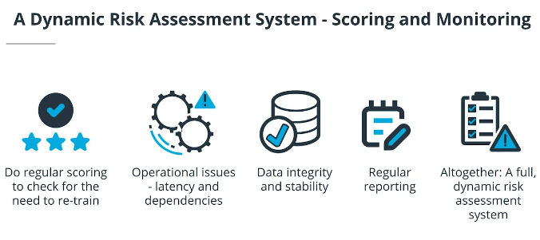

# Dynamic-Risk-Assessment-System
## Project description
In this project we want to create, deploy, and monitor a risk assessment ML model that will estimate the 
attrition risk of each of some company's clients. If the model we create and deploy is accurate, 
it will enable the client managers to contact the clients with the highest risk and avoid losing clients 
and revenue. Because the industry is dynamic and constantly changing,  and the model that has been created 
a month ago might not still be accurate today, it is necessary to setup a process and scripts to re-train, 
re-deploy, monitor and report the ML model, so the comapny get risk assessement that are as accurate as 
possible to avoid client attrition. 

<p align="center">

</p>

### Overview of the pipeline code organisation 
```
├── Makefile
├── README.md
├── apicalls.py
├── app.py
├── config.json
├── deployment.py
├── diagnostics.py
├── environment.yml
├── fullprocess.py
├── fullprocess.sh
├── images
│   └── dynamic-risk.png
├── ingesteddata
│   ├── finaldata.csv
│   └── ingestedfiles.txt
├── ingestion.py
├── logs
│   ├── latestscore.txt
│   └── outdated.txt
├── models
│   ├── confusion_matrix.png
│   └── trainedmodel.pkl
├── practicedata
│   ├── dataset1.csv
│   └── dataset2.csv
├── practicemodels
│   ├── apireturn.txt
│   ├── confusion_matrix.png
│   ├── latestscore.txt
│   └── trainedmodel.pkl
├── production_deployment
│   ├── finaldata.csv
│   ├── ingestedfiles.txt
│   ├── latestscore.txt
│   └── trainedmodel.pkl
├── reporting.py
├── requirements.txt
├── scoring.py
├── sourcedata
│   ├── dataset3.csv
│   └── dataset4.csv
├── testdata
│   └── testdata.csv
├── training.py
└── wsgi.py
```
### Directories 
* ``practicedata``: directory which contains data used for test and practice purposes.
* ``sourcedata``: directory which contains data that needed to load and train risk models.
* ``ingesteddata``: directory which contains the compiled datasets that the ingestion script has processed.
* ``testdata``: directory contains data used for testing and evaluating models.
* ``models``: directory which contains ML models ready for production.
* ``practicemodels``: directory which contains ML models that you created for test and practice purposes.
* ``production_deployment``: directory which contains final and deployed models.
* ``logs``: directory which contains logs of packages to update
### Script files
The following are the Python files that are in the starter files:


`training.py`, a Python script meant to train an ML model

`scoring.py`, a Python script meant to score an ML model

`deployment.py`, a Python script meant to deploy a trained ML model

`ingestion.py`, a Python script meant to ingest new data

`diagnostics.py`, a Python script meant to measure model and data diagnostics

`reporting.py`, a Python script meant to generate reports about model metrics

`app.py`, a Python script meant to contain API endpoints

`wsgi.py`, a Python script to help with API deployment

`apicalls.py`, a Python script meant to call your API endpoints

`fullprocess.py`, a script meant to determine whether a model needs to be re-deployed, and to call all other Python scripts when needed


### Config file 
This file contains five entries:

* `input_folder_path`, which specifies the location where your project will look for input data, to ingest, and to use in model training. If you change the value of input_folder_path, your project will use a different directory as its data source, and that could change the outcome of every step.
* `output_folder_path`, which specifies the location to store output files related to data ingestion. In the starter version of config.json, this is equal to /ingesteddata/, which is the directory where you'll save your ingested data later in this step.
* `test_data_path`, which specifies the location of the test dataset
* `output_model_path`, which specifies the location to store the trained models and scores.
* `prod_deployment_path`, which specifies the location to store the models in production.

### Dataset 
The column features of the data are given as follows:

* `corporation`, which contains four-character abbreviations for names of corporations
* `lastmonth_activity`, which contains the level of activity associated with each corporation over the previous month*
* `lastyear_activity`, which contains the level of activity associated with each corporation over the previous year
* `number_of_employees`, which contains the number of employees who work for the corporation
* `exited`, which contains a record of whether the corporation exited their contract (1 indicates that the corporation exited, and 0 indicates that the corporation did not exit)
* The dataset's final column, "exited", is the target variable for our predictions. The first column, "corporation", will not be used in modeling. The other three numeric columns will all be used as predictors in your ML model.

## 1. Data ingestion
```bash
> python ingestion.py
```
This script checks if there is any available data in the directory specified in `input_folder_path` and then 
saves the compiled dataset `finaldata.csv` in the directory specified in `output_model_path`. 
A record of the previous directory, names of ingested files, their length and date of ingestion is saved in a text file `ingestedfiles.txt`
that contains the names of the newly ingested data files together with 

## 2. Training, Scoring, and Deploying an ML Model
In this step we will present three scripts. One script will be for training a Logistic Regression model to 
predict attrition risk of customers, another will be for generating scoring metrics for the model, 
and the third will be for deploying the trained model.

### Model training 
```bash 
> python training.py
```
This script train a logistic 
